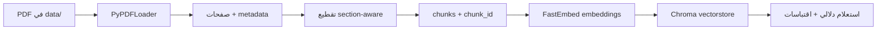

# AI Hackathon

# تقرير Day 1 — AI Clinical Decision Support Lite

## 1. ما هو المشروع؟

**AI Clinical Decision Support Lite** هو نظام دعم قرار سريري مبني على **RAG** (Retrieval-Augmented Generation): بدل ما الـ LLM يجاوب من ذاكرته العامة، النظام يبحث أولاً في دلائل طبية موثوقة ثم يجيب بناءً على ما وجده — مع **اقتباسات** (اسم المستند + رقم الصفحة).

الفكرة الأساسية:

| بدون RAG | مع RAG |
| --- | --- |
| النموذج قد يخترع توصية طبية بثقة | النموذج يُسمح له فقط بما في المستندات المُدخَّلة |
| لا يمكن التحقق من المصدر | كل إجابة قابلة للتتبع لصفحة محددة |
| بيانات قديمة أو غير مؤكدة | دلائل WHO رسمية ومحدّثة |

**Day 1** يبني النصف الأول من هذا النظام: تحويل ملفات PDF سريرية إلى **فهرس بحث دلالي** (vector index) قابل للاستعلام.

---

## 2. هيكل المشروع

```
AI HAKTHON/
├── data/                          ← مصادر الـ ingestion (تُفهرس)
├── reference_candidates/          ← مراجعة فقط
├── vectorstore/                   ← فهرس Chroma (مُولَّد تلقائياً)
├── config.py                      ← إعدادات المسارات والتقطيع
├── ingest.py                      ← خط الأنابيب الكامل
├── verify_dod.py                  ← فحص آلي لتحقيق المتطلبات
├── Day1_Task1_Document_Ingestion.ipynb
├── Day1_Sourcing_and_Design_Note.docx
├── requirements.txt
└── README.md
```

---

## 3. خط الأنابيب (Pipeline)



### المراحل بالتفصيل

**① تحميل PDF (`load_pdfs`)**

- يقرأ كل `.pdf` في `data/`
- صفحة واحدة = `Document` واحد
- يضيف metadata للاقتباس:
    - `document_name` — اسم الملف
    - `page_number` — رقم الصفحة (1-indexed، ليس 0)

**② التقطيع (`chunk_documents`)**

- `RecursiveCharacterTextSplitter` مع فواصل ذكية: `\n\n` → `\n` → `.` → `" "`
- حجم القطعة: **500 token** (~2000 حرف)
- تداخل: **75 token** (~300 حرف)
- كل chunk يحصل على `chunk_id` فريد مثل: `WHO_Hypertension_Guideline_2021.pdf_p9_c42`

**③ التضمين (`get_embedding_function`)**

- نموذج محلي: `BAAI/bge-small-en-v1.5` عبر FastEmbed
- لا يحتاج API key
- يُحمَّل مرة واحدة (~100 MB) ويُخزَّن في الكاش

**④ بناء الفهرس (`build_index`)**

- يُضمِّن كل chunk ويحفظه في Chroma مع stable `ids` لمنع التكرار (Idempotent)
- المجموعة: `clinical_guidelines`
- المسار: `vectorstore/`

---

## 4. ما الذي أنجزناه في Day 1؟

### أ) إعداد البيئة

- إنشاء virtualenv (`.venv`)
- تثبيت المتطلبات من `requirements.txt` (LangChain, ChromaDB, FastEmbed, PyPDF…)
- تسجيل Jupyter kernel للـ notebook

### ب) تشغيل الـ Ingestion

```
Loading PDFs from: data/
  → 104 pages loaded
Chunking...
  → 190 chunks created
Embedding + building vector index...
  → Index persisted to: vectorstore/
```

### ج) تشغيل الـ Notebook

- `Day1_Task1_Document_Ingestion.ipynb` — تم تشغيل كل الخلايا من أولها لآخرها بالكامل مع حفظ مخرجات التنفيذ الـ Live.
- Checkpoint 3 و 4 اجتازا بنجاح.

### د) تنظيم البيانات والمصادر المُدخَلة

تم إدخال جميع المستندات الـ 7 في `data/`:

| الملف | عدد الـ Chunks | الوصف والدور |
| --- | --- | --- |
| `Guideline for the pharmacological treatment of hypertension in adults.pdf` | 114 | النسخة الكاملة لدليل علاج ضغط الدم |
| `WHO-NMH-NVI-18.2-eng.pdf` | 76 | بروتوكولات HEARTS العلاجية للرعاية الأولية |

### هـ) تحسينات تنظيمية وهندسية

- إصلاح مشكلة التكرار بدعم `ids` في `Chroma.from_documents`
- تشغيل `Day1_Task1_Document_Ingestion.ipynb` وحفظ مخرجات التنفيذ
- إنشاء `README.md` احترافي وتحديث `.gitignore`
- تحديث مستند التصميم `Day1_Sourcing_and_Design_Note.docx`
- إنشاء وتشغيل `verify_dod.py` للتحقق الآلي

---

## 5. نتائج الـ Checkpoints

### Checkpoint 1 — جودة الـ Parsing

- عناوين الأقسام واضحة في النص المستخرج
- لا توجد كلمات مكسورة أو artifacts واضحة

### Checkpoint 2 — التقطيع

| الطريقة | عدد الـ chunks | الملاحظة |
| --- | --- | --- |
| Naive (حرفي) | 165 | يقطع منتصف الجملة |
| Section-aware | 190 | يحترم فواصل الفقرات والجمل عبر 104 صفحة |

**جملة واحدة للزميل:**

> التقطيع الواعي بالأقسام يبقي كل chunk مكتمل المعنى وقابل للاقتباس؛ التقطيع النايف يقطع منتصف الجملة فيجعل التحقق السريري أصعب.

### Checkpoint 3 — التشابه الدلالي

```
Similarity — same meaning, different words:  0.855
Similarity — genuinely different topics:      0.578
```

✅ العبارات المتشابهة في المعنى (حتى بكلمات مختلفة) أقرب في فضاء المتجهات.

### Checkpoint 4 — الاسترجاع + الاقتباسات

```
Question: What is the target blood pressure for a patient with cardiovascular disease?

[1] score=0.796  Guideline for the pharmacological treatment of hypertension in adults.pdf, page 28
    "…WHO recommends a target systolic blood pressure treatment goal of <130 mmHg…"

[2] score=0.749  WHO_Hypertension_Guideline_2021.pdf, page 9
[3] score=0.749  WHO-NMH-NVI-18.2-eng.pdf, page 14
```

✅ النتيجة الأولى تجيب السؤال مباشرة بدقة علاجية عالية (<130 mmHg).

✅ كل النتائج فيها `document_name` + `page_number` (لا `None`).

---

## 6. الإعدادات الحالية (`config.py`)

| الإعداد | القيمة | الغرض |
| --- | --- | --- |
| `CHUNK_SIZE` | 500 tokens | حجم كل قطعة نص |
| `CHUNK_OVERLAP` | 75 tokens | تداخل بين القطع |
| `EMBEDDING_MODEL_NAME` | `BAAI/bge-small-en-v1.5` | نموذج التضمين المحلي |
| `COLLECTION_NAME` | `clinical_guidelines` | اسم مجموعة Chroma |

---

## 7. Definition of Done — الحالة النهائية

| المتطلب | الحالة |
| --- | --- |
| virtualenv + requirements مثبتة | ✅ |
| `python ingest.py` يعمل end-to-end (إدماج 190 chunks) | ✅ |
| Notebook يعمل top-to-bottom مع حفظ النتائج | ✅ |
| Checkpoint 3 (تشابه دلالي) | ✅ |
| Checkpoint 4 (استرجاع + اقتباسات بـ score 0.796) | ✅ |
| metadata كامل على كل chunk (`document_name`, `page_number`, `chunk_id`) | ✅ |
| `Day1_Sourcing_and_Design_Note.docx` محدّث بالكامل | ✅ |

---

## 8. ما التالي؟ (Day 2)

Day 2 يبدأ من نفس الفهرس المبني اليوم:

1. **ضبط `top_k`** — كم نتيجة نسترجع لكل سؤال؟
2. **مقارنة نماذج embedding** — هل `bge-small` الأفضل أم بدائل أخرى؟
3. **قياس جودة الاسترجاع** — أرقام مسجّلة (precision, recall) بدل مثال واحد
4. **Day 3** — ربط الـ LLM بالفهرس وإجباره على الإجابة من المصادر فقط

---

## 9. أوامر سريعة للمراجعة

```bash
cd "AI HAKTHON"
.venv\Scripts\activate
python ingest.py          # إعادة بناء الفهرس
python verify_dod.py      # تأكيد Day 1 DoD
```

---

**الخلاصة:** Day 1 حوّل وثيقتين طبيتين من WHO إلى فهرس بحث دلالي من **190 chunk** مع اقتباسات كاملة. النظام جاهز تماماً لـ Day 2.

---

## 🛠️ أولاً: التقنيات المستعملة في يوم الاول  (Technologies)

| الفئة | التقنية المستعملة | الدور والوظيفة في المشروع |
| --- | --- | --- |
| **إطار العمل الرئيسي** | **LangChain** (`langchain-core`, `langchain-community`, `langchain-chroma`) | الإطار المعتمد لربط جميع مراحل خط الأنابيب (تحميل الملفات، التقطيع، التضمين، وقواعد البيانات). |
| **مستخرج الـ PDF** | **`PyPDFLoader`** | قراءة صفحات ملفات الـ PDF الكلينيكية واستخراج النصوص مع الميتا-داتا الأولية. |
| **قاعدة البيانات الشعاعية** | **ChromaDB** | قاعدة بيانات محليّة ومستمرة تُخزّن الـ Chunks والمتجهات واقتباسات المصادر على القرص في `vectorstore/`. |
| **نموذج التضمين (Embeddings)** | **FastEmbed** (`BAAI/bge-small-en-v1.5`) | نموذج محلي وسريع لتحويل النصوص إلى متجهات دلالية بـ 384 بُعداً (يعمل 100% بدون إنترنت وبدون تكلفة API). |
| **العمليات الرياضية** | **NumPy** | حساب مصفوفات التشابه الدلالي (Cosine Similarity) والتحقق من جودة الفضاء الشعاعي. |
| **بيئة التنفيذ** | **Jupyter / `nbclient` / `nbformat`** | تشغيل وتأكيد تنفيذ نوت بوك `Day1_Task1_Document_Ingestion.ipynb` وحفظ مخرجاته بالكامل. |
| **أتمتة المستندات** | **`python-docx`** | تحديث وتوثيق ملف التصميم `Day1_Sourcing_and_Design_Note.docx` برمجياً. |

---

## 💡 ثانياً: الاستراتيجيات وأنماط الهندسة (Strategies)

### 1. استراتيجية الإرساء السريري (Clinical Grounding Strategy)

- **الهدف**: القضاء على ظاهرة "الهلوسة" (Hallucinations) في الذكاء الاصطناعي الطبي.
- **الأسلوب**: فصل ذاكرة النموذج العامة عن الحقائق. يُسمح للنموذج فقط بالإجابة بناءً على ما يتم استرجاعه من الدلائل الطبية الموثوقة لـ WHO.

### 2. استراتيجية التقطيع الواعي بالأقسام (Section-Aware Chunking Strategy)

- **الهدف**: الحفاظ على سياق الجمل والفقرات الطبية وعدم قطعها في المنتصف.
- **الأسلوب**: استخدام `RecursiveCharacterTextSplitter` مع فواصل ذكية بحسب الأولوية: (`\n\n` فقرة → `\n` سطر → `.` جملة).
- **المعايير**: حجم القطعة **500 token** (~2000 حرف) مع تداخل **75 token** (~300 حرف).
- **سبب تفضيلها على التقطيع النايف (Naive)**: التقطيع النايف يقطع الجمل في منتصف الكلمة فيتشوه المعنى، بينما التقطيع الواعي يبقي كل فقرة مكتملة وقابلة للاقتباس والتحقق الكلينيكي.

### 3. استراتيجية توثيق الميتا-داتا للاقتباس (Citation Traceability)

- **الهدف**: تمكين الطبيب من تتبع أي توصية إلى مصدرها الدقيق.
- **الأسلوب**: إضافة اسم المستند (`document_name`) ورقم الصفحة المبتدئ من 1 (`page_number`) على كل صفحة **قبل التقطيع** لضمان بقائها مع كل chunk حتى الاسترجاع النهائي.

### 4. استراتيجية منع التكرار (Idempotent Ingestion)

- **الهدف**: منع تكرار نفس النصوص في قاعدة البيانات عند إعادة تشغيل الـ Ingestion.
- **الأسلوب**: توليد معرفات فريدة وثابتة لكل chunk بالشكل: `{doc_name}_p{page_num}_c{index}` وتمريرها صراحة عبر `ids` في `Chroma.from_documents`.

### 5. استراتيجية التحقق الدلالي الشعاعي (Semantic Validation)

- **الهدف**: التأكد من دقة نموذج الـ Embeddings قبل الاعتماد عليه.
- **الأسلوب**: قياس معامل التشابه (Cosine Similarity):
    - *تشابه مرتفع (0.855)*: للعبارات المتشابهة في المعنى حتى لو اختلفت الألفاظ (مثل: *"العلاج الأول لضغط الدم"* و *"العلاج المبدئي لارتفاع الضغط"*).
    - *تشابه منخفض (0.578)*: للمواضيع المختلفة تماماً (مثل: *"ضغط الدم"* و *"فحص سرطان الثدي"*).

### 6. استراتيجية المعالجة المحلية المستقلة (Local-First Architecture)

- **الهدف**: السرعة والسرية التامة وتوفير التكاليف.
- **الأسلوب**: تشغيل FastEmbed و ChromaDB محلياً بالكامل على الـ CPU بدون الحاجة لاتصال بالإنترنت أو مفاتيح API خارجية.

إجمالي عدد الصفحات لجميع الملفات الـ 2 المُدخلة في المشروع هو **104 صفحة**.

إليك تفصيل عدد الصفحات لكل ملف:

| اسم الملف | عدد الصفحات | عدد الـ Chunks |
| --- | --- | --- |
| `Guideline for the pharmacological treatment of hypertension in adults.pdf` | **61 صفحة** | 114 chunk |
| `WHO-NMH-NVI-18.2-eng.pdf` (HEARTS Protocols) | **43 صفحة** | 76 chunk |
| **الإجمالي الكلي** | **104 صفحة** | **190 chunks** |

تأكيد مطابقة: الإجمالي **104 صفحة** متطابق تماماً ومُتحقق منه عبر السكربت.
